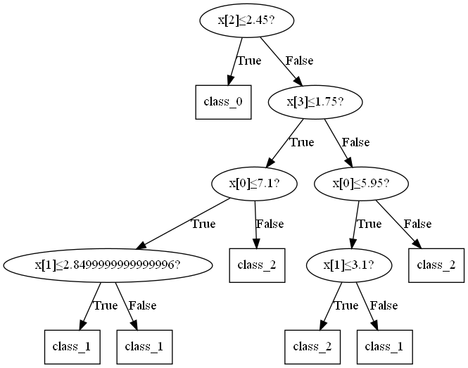
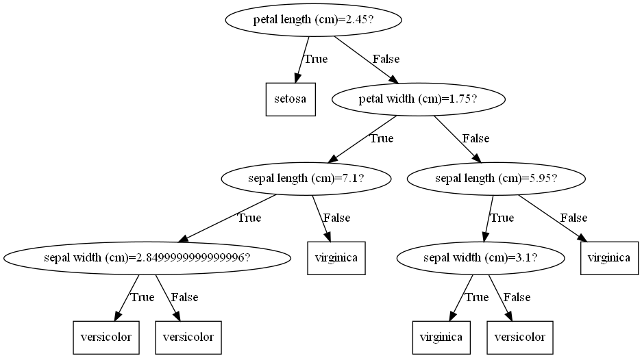
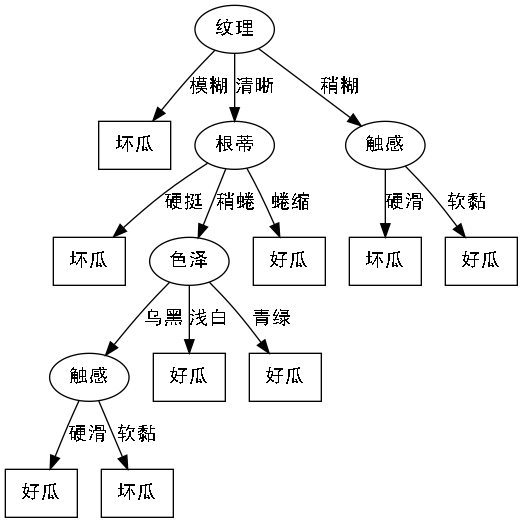
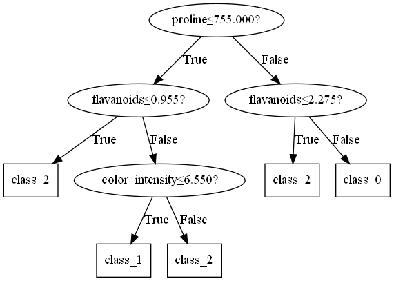
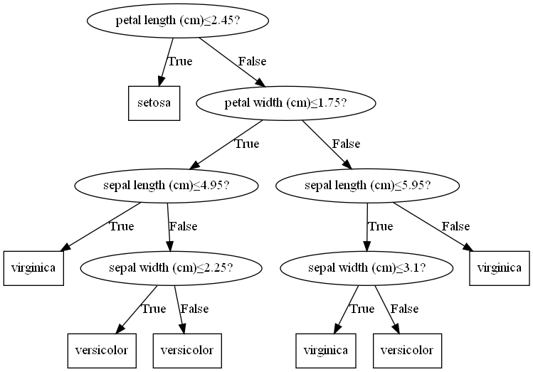
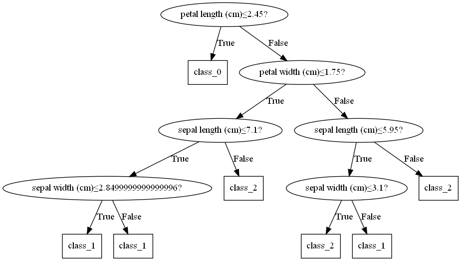
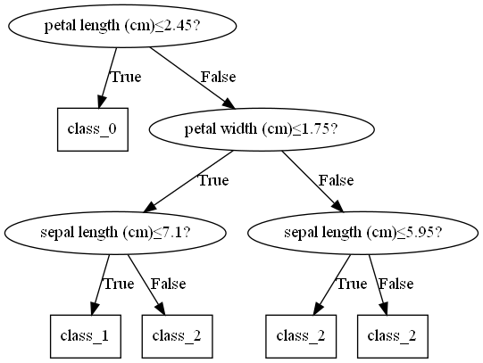

# PyDecisionTree

决策树分类与回归模型，以及可视化

- [x] ID3分类
- [x] C4.5分类树
- [x] CART分类树
- [x] CART回归树
- [x] 决策树可视化
- [x] REP剪枝
- [x] PEP剪枝
- [x] CCP剪枝

## ID3

ID3决策树是最朴素的决策树分类器：

- 无剪枝
- 只支持离散属性
- 采用信息增益准则

在`data.py`中，我们记录了一个小的西瓜数据集，用于离散属性的二分类任务。我们可以像下面这样训练一个ID3决策树分类器：

```python
from ID3 import ID3Classifier
from data import load_watermelon2
import numpy as np

X, y = load_watermelon2(return_X_y=True) # 函数参数仿照sklearn.datasets
model = ID3Classifier()
model.fit(X, y)
pred = model.predict(X)
print(np.mean(pred == y))
```

输出1.0，说明我们生成的决策树是正确的。

## C4.5

C4.5决策树分类器对ID3进行了改进：

- 用信息增益率的启发式方法来选择划分特征；
- 能够处理离散型和连续型的属性类型，即将连续型的属性进行离散化处理；
- 剪枝；
- 能够处理具有缺失属性值的训练数据；

我们实现了前两点，以及第三点中的预剪枝功能（超参数）

在`data.py`中还有一个连续离散特征混合的西瓜数据集，我们用它来测试C4.5决策树的效果：

```python
from C4_5 import C4_5Classifier
from data import load_watermelon3
import numpy as np

X, y = load_watermelon3(return_X_y=True) # 函数参数仿照sklearn.datasets
model = C4_5Classifier()
model.fit(X, y)
pred = model.predict(X)
print(np.mean(pred == y))
```

输出1.0，说明我们生成的决策树正确.

## CART

### 分类

CART(Classification and Regression Tree)是C4.5决策树的扩展，支持分类和回归。CART分类树算法使用基尼系数选择特征，此外对于离散特征，CART决策树在每个节点二分划分，缓解了过拟合。

这里我们用`sklearn`中的鸢尾花数据集测试：

```python
from CART import CARTClassifier
from sklearn.datasets import load_iris
from sklearn.model_selection import train_test_split
from sklearn.metrics import accuracy_score

X, y = load_iris(return_X_y=True)
train_X, test_X, train_y, test_y = train_test_split(X, y, train_size=0.7)
model = CARTClassifier()
model.fit(train_X, train_y)
pred = model.predict(test_X)
print(accuracy_score(test_y, pred))
```

准确率95.55%。

### 回归

`CARTRegressor`类实现了决策树回归，以`sklearn`的波士顿数据集为例：

```python
from CART import CARTRegressor
from sklearn.datasets import load_boston
from sklearn.model_selection import train_test_split
from sklearn.metrics import mean_squared_error

X, y = load_boston(return_X_y=True)
train_X, test_X, train_y, test_y = train_test_split(X, y, train_size=0.7)
model = CARTRegressor()
model.fit(train_X, train_y)
pred = model.predict(test_X)
print(mean_squared_error(test_y, pred))
```

输出26.352171052631576，sklearn决策树回归的Baseline是22.46，性能近似，说明我们的实现正确。

## 决策树绘制

### 分类树

利用python3的graphviz第三方库和[Graphviz](https://graphviz.org/)(需要安装)，我们可以将决策树可视化：

```python
from plot import tree_plot
from CART import CARTClassifier
from sklearn.datasets import load_iris

X, y = load_iris(return_X_y=True)
model = CARTClassifier()
model.fit(X, y)
tree_plot(model)
```

运行，文件夹中生成`tree.png`：



如果提供了特征的名词和标签的名称，决策树会更明显：

```python
from plot import tree_plot
from CART import CARTClassifier
from sklearn.datasets import load_iris

iris = load_iris()
model = CARTClassifier()
model.fit(iris.data, iris.target)
tree_plot(model,
          filename="tree2",
          feature_names=iris.feature_names,
          target_names=iris.target_names)
```



绘制西瓜数据集2对应的ID3决策树：

```python
from plot import tree_plot
from ID3 import ID3Classifier
from data import load_watermelon2

watermelon = load_watermelon2()
model = ID3Classifier()
model.fit(watermelon.data, watermelon.target)
tree_plot(
    model,
    filename="tree",
    font="SimHei",
    feature_names=watermelon.feature_names,
    target_names=watermelon.target_names,
)
```

这里要自定义字体，否则无法显示中文：



### 回归树

用同样的方法，我们可以进行回归树的绘制：

```python
from plot import tree_plot
from ID3 import ID3Classifier
from sklearn.datasets import load_boston

boston = load_boston()
model = ID3Classifier(max_depth=5)
model.fit(boston.data, boston.target)
tree_plot(
    model,
    feature_names=boston.feature_names,
)
```

由于生成的回归树很大，我们限制最大深度再绘制：


## 调参

CART和C4.5都是有超参数的，我们让它们作为`sklearn.base.BaseEstimator`的派生类，借助`sklearn`的GridSearchCV，就可以实现调参：

```python
from plot import tree_plot
from CART import CARTClassifier
from sklearn.datasets import load_wine
from sklearn.model_selection import train_test_split, GridSearchCV

wine = load_wine()
train_X, test_X, train_y, test_y = train_test_split(
    wine.data,
    wine.target,
    train_size=0.7,
)
model = CARTClassifier()
grid_param = {
    'max_depth': [2, 4, 6, 8, 10],
    'min_samples_leaf': [1, 3, 5, 7],
}

search = GridSearchCV(model, grid_param, n_jobs=4, verbose=5)
search.fit(train_X, train_y)
best_model = search.best_estimator_
print(search.best_params_, search.best_estimator_.score(test_X, test_y))
tree_plot(
    best_model,
    feature_names=wine.feature_names,
    target_names=wine.target_names,
)
```

输出最优参数和最优模型在测试集上的表现：

```python
{'max_depth': 4, 'min_samples_leaf': 3} 0.8518518518518519
```

绘制对应的决策树：



## 剪枝

在ID3和CART回归中加入了REP剪枝，C4.5则支持了PEP剪枝，CART分类树使用的是CCP剪枝。

剪枝参考: <https://welts.xyz/2021/09/27/prune/>

### PEP剪枝

对IRIS数据集训练后的决策树进行PEP剪枝：

```python
iris = load_iris()
model = C4_5Classifier()
X, y = iris.data, iris.target
train_X, test_X, train_y, test_y = train_test_split(X, y, train_size=0.7)
model.fit(train_X, train_y)
print(model.score(test_X, test_y))
tree_plot(model,
          filename="src/pre_prune",
          feature_names=iris.feature_names,
          target_names=iris.target_names)
model.pep_pruning()
print(model.score(test_X, test_y))
tree_plot(model,
          filename="src/post_prune",
          feature_names=iris.feature_names,
          target_names=iris.target_names,
)
```

剪枝前后的准确率分别为97.78%，100%，即泛化性能的提升：



### CCP剪枝

对IRIS数据集训练后的决策树进行CCP剪枝：

剪枝前后：


